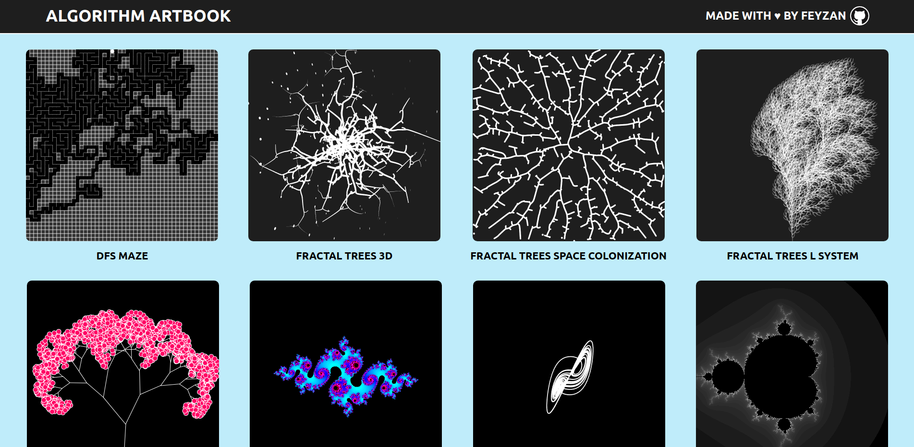

<<<<<<< HEAD
# generative-art
=======
<<<<<<< HEAD
# generative-art
=======
# Algorithm Artbook

Collection of images created by implementing various algorithms in p5.js.

<<<<<<< HEAD

>>>>>>> e3bf7c8 (Add images)
=======
- #### [See Live](https://algorithmartbook.herokuapp.com/) 💜

### List

- [Lorenz Attractor](./sketches/lorenz-attractor)
- [Maze DFS](./sketches/maze-dfs)
- [Menger Sponge Fractal](./sketches/menger-sponge-fractal)
- [Neon Rain](./sketches/neon-rain)
- [Perlin Noise Terrain](./sketches/perlin-noise-terrain)
- [Solar System 2D](./sketches/solar-system-2d)
- [Solar System 3D](./sketches/solar-system-3d)
- [Spots](./sketches/spots)
- [Starfield](./sketches/starfield)

---

### Resources

- [The Nature Of Code](https://natureofcode.com/)
- [The Coding Train](https://thecodingtrain.com/)
>>>>>>> 36f2776 (Add lorenz attractor, update README.md)
>>>>>>> 00e4e67 (Add lorenz attractor, update README.md)
