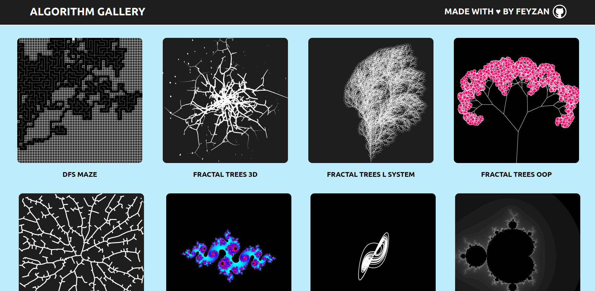

# Processing Gallery

## Overview

[Processing](https://processing.org/) is a graphical library and IDE built for coding within the context of visual arts. Processing mainly uses Java but it has different programming modes to make it possible to deploy sketches on different platforms and program in different ways (JavaScript, JRuby, Python, Clojure). Processing Gallery is a collection of Processing sketches written in Python. The majority of the sketches were inspired by Daniel Shiffman's original [Java and JavaScript versions](https://thecodingtrain.com/challenges).

- ### [See Website](https://processinggallery.onrender.com/)

## Installation

You can download and install Processing from [here](https://processing.org/download). Processing doesn't include support for the Python programming language by default. In order to enable Python support, you'll need to install an add-on called Python Mode. You can do this by clicking on the drop-down menu on the right side of the tool bar and selecting **"Add Mode..."** A window with the title **"Mode Manager"** will appear. Scroll down until you see **"Python"** and press **"Install"**. If you want to learn more about Python Mode visit [Processing.py](https://py.processing.org/).

You can download this whole repository by running `git clone https://github.com/feyzanaydemir/processing-gallery.git`, or you can individually download sketches from the list below.

## List

- Attraction and Repulsion: [Python](sketches/attraction_and_repulsion)
- Fractal Trees - 3D: [Python](sketches/fractal_trees_3d) | [p5.js Editor](https://editor.p5js.org/feyzan/sketches/B3dfzBf4s)
- Fractal Trees - L System: [Python](sketches/fractal_trees_l_system) | [p5.js Editor](https://editor.p5js.org/feyzan/sketches/qGTI6pxGd)
- Fractal Trees - OOP: [Python](sketches/fractal_trees_oop) | [p5.js Editor](https://editor.p5js.org/feyzan/sketches/cGsK2LzGP)
- Fractal Trees - Space Colonization: [Python](sketches/fractal_trees_space_colonization) | [p5.js Editor](https://editor.p5js.org/feyzan/sketches/XiTEAk4cv)
- Glitch: [Python](sketches/glitch) | [p5.js Editor](https://editor.p5js.org/feyzan/sketches/kF8nJwMhY)
- Julia Set: [Python](sketches/julia_set) | [p5.js Editor](https://editor.p5js.org/feyzan/sketches/gqukZ3VmF)
- Lorenz Attractor: [Python](sketches/lorenz_attractor) | [p5.js Editor](https://editor.p5js.org/feyzan/sketches/vmlTm3jZA)
- Mandelbrot Set: [Python](sketches/mandelbrot_set) | [p5.js Editor](https://editor.p5js.org/feyzan/sketches/hJ81Frydu)
- Maze - Depth First Search: [Python](sketches/dfs_maze) | [p5.js Editor](https://editor.p5js.org/feyzan/sketches/urr4nLyuC)
- Menger Sponge Fractal: [Python](sketches/menger_sponge_fractal) | [p5.js Editor](https://editor.p5js.org/feyzan/sketches/L3PK7DunV)
- Metaballs: [Python](sketches/metaballs) | [p5.js Editor](https://editor.p5js.org/feyzan/sketches/RxTuUXXYH)
- Neon Rain: [Python](sketches/neon_rain) | [p5.js Editor](https://editor.p5js.org/feyzan/sketches/7mU_b6Qah)
- Perlin Noise Flow Field: [Python](sketches/perlin_noise_flow_field)
- Perlin Noise Terrain: [Python](sketches/perlin_noise_terrain) | [p5.js Editor](https://editor.p5js.org/feyzan/sketches/MsmcYDI7L)
- Phyllotaxis: [Python](sketches/phyllotaxis) | [p5.js Editor](https://editor.p5js.org/feyzan/sketches/Fb73lMc1N)
- Poission Disc: [Python](sketches/poission_disc) | [p5.js Editor](https://editor.p5js.org/feyzan/sketches/fhac3S6iR)
- Rose Patterns: [Python](sketches/rose_patterns)
- Solar System - 2D: [Python](sketches/solar_system_2d) | [p5.js Editor](https://editor.p5js.org/feyzan/sketches/Tf196VW7Z)
- Solar System - 3D: [Python](sketches/solar_system_3d) | [p5.js Editor](https://editor.p5js.org/feyzan/sketches/0Lc2mWEyQ)
- Starfield: [Python](sketches/starfield) | [p5.js Editor](https://editor.p5js.org/feyzan/sketches/boC-VZdIG)
- Supershape: [Python](sketches/supershape) | [p5.js Editor](https://editor.p5js.org/feyzan/sketches/M-kcTWK9T)
